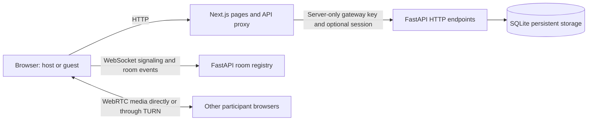
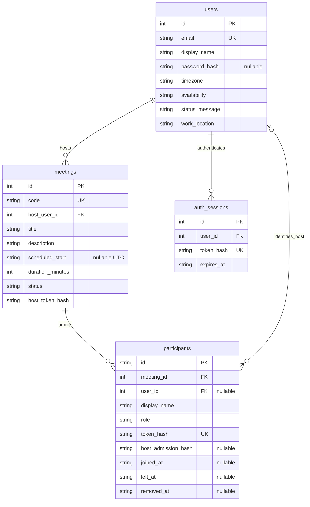

# ZOOM-CLONE: a Zoom meeting platform clone

A full-stack video conferencing application: create instant meetings, share invitations, join from a browser,
schedule meetings, and make real audio/video calls. The interface follows the supplied Zoom Workplace
references, with a navigation rail, centered meeting actions, modal Join/Schedule flows and a compact call toolbar.

- **Repository:** [Rupinder51120/zoom-clone](https://github.com/Rupinder51120/zoom-clone)
- **Live demo:** Deployment pending; no verified public application URL yet.
- **Stack:** Next.js 16 (TypeScript) · FastAPI (Python) · SQLite · SQLAlchemy 2 · Alembic · WebRTC · WebSockets
- **Verification:** Latest local acceptance run on 9 October 2026: **60 backend tests and 9 production-browser tests passed**. Synthetic media devices were used; physical-device and cross-network testing remain pending.
- **Feature checklist:** [corefeatures.md](corefeatures.md)

---

## Contents

1. [Features](#features)
2. [Tech stack](#tech-stack)
3. [Running it locally](#running-it-locally)
4. [Architecture](#architecture)
5. [Database schema](#database-schema)
6. [API overview](#api-overview)
7. [Testing](#testing)
8. [Deployment](#deployment)
9. [Design decisions](#design-decisions)
10. [Assumptions](#assumptions)
11. [Known limitations and future work](#known-limitations-and-future-work)

---

## Features

### Core

| Area | What you can do |
|---|---|
| **Dashboard** | Create, join and schedule meetings; view upcoming and recent meetings; search by title or ID; access profile/settings |
| **Instant meetings** | Generate a unique 11-digit meeting ID and invite link; open the host's meeting room |
| **Joining** | Enter a meeting ID or invitation URL, choose a display name, validate meeting existence, preview devices and choose initial audio/video settings |
| **Scheduling** | Save a title, optional description, date/time, IANA timezone, duration and host video preference; copy the generated invitation |
| **Meeting details** | View saved scheduling information, copy an invitation, start as the owner or join as a guest |
| **Live calls** | Browser WebRTC audio/video, microphone/camera controls, participants, screen sharing, invitations, leave and end-for-everyone |
| **Persistence** | SQLite meeting metadata and participant join/leave/removal history; scheduled meetings survive refresh and backend restart |

### Bonus and additional functionality

- **Optional authentication:** signup, signin, signout and password changes; personal accounts own their meetings. All mandatory workflows also work without login.
- **Host controls:** backend-authorized mute-all, participant removal and end-for-everyone.
- **Responsive appearance:** desktop, tablet and mobile layouts; light/dark theme follows system settings.
- **Meeting collaboration:** live text chat, six emoji reactions and raise/lower hand indicators.
- **Meeting navigation:** mini calendar, day navigation, Upcoming/Previous filters, refresh and iCalendar (`.ics`) export.
- **Profile preferences:** save manually selected availability, a status message and work location.

Unsupported screenshot products open a **Preview only** notice or appear as disabled options. Recording,
AI tools, paid upgrades, connected calendars and breakout rooms are not implemented services.

### Seed data

On a fresh database, startup creates the demo user **Rupinder Kaur** (`demo@example.com`) and five meetings:

| Meeting | Initial status | Duration |
|---|---|---|
| Product design review | Upcoming, one day after initial startup | 40 minutes |
| Engineering team sync | Upcoming, two days after initial startup | 30 minutes |
| Weekly project catch-up | Upcoming, three days after initial startup | 60 minutes |
| Sprint planning | Completed sample meeting | 45 minutes |
| Design walkthrough | Completed sample meeting | 30 minutes |

Seed dates are relative to the first startup. Restarting preserves existing records rather than resetting their dates.
There is no built-in demo password. Optional `DEMO_PASSWORD` provisions a missing demo password without overwriting an existing one.

---

## Tech stack

| Layer | Choice | Purpose |
|---|---|---|
| Frontend | **Next.js 16**, App Router, TypeScript | Pages, shared layouts and server API proxy |
| Styling | **Tailwind CSS 4** and CSS variables | Reference layout, responsive styles and system light/dark themes |
| UI | Native HTML dialogs, React components, Lucide icons | Modal focus containment and reusable controls |
| Backend | **FastAPI**, Pydantic | HTTP endpoints, validation, WebSocket admission and room events |
| Database | **SQLite**, **SQLAlchemy 2**, **Alembic** | Persistent records, relationships and versioned migrations |
| Media | Browser **WebRTC** | Peer-to-peer audio/video and screen tracks; configurable STUN/TURN |
| Room events | **WebSockets** | Signaling, participants, chat, reactions, hands and host commands |
| Verification | pytest, Playwright, Ruff, TypeScript, Prettier | API/browser regression tests and code checks |
| Deployment | GitHub Actions, **Railway** backend, **Vercel** frontend | CI and configured release workflow |

---

## Running it locally

Prerequisites: **Python 3.11+**, **Node.js 20.9+** and Git. CI uses Python 3.11 and Node.js 22.
Run backend commands from `backend/` so the default SQLite path resolves consistently.

### 1. Backend — port 8000

macOS / Linux:

```bash
cd backend
python3 -m venv .venv
source .venv/bin/activate
python -m pip install -r requirements.lock.txt
cp .env.example .env
python -m alembic upgrade head
python -m uvicorn app.main:app --host 0.0.0.0 --port 8000 --workers 1
```

Windows / PowerShell:

```powershell
cd backend
py -3.11 -m venv .venv
.\.venv\Scripts\Activate.ps1
python -m pip install -r requirements.lock.txt
Copy-Item .env.example .env
python -m alembic upgrade head
python -m uvicorn app.main:app --host 0.0.0.0 --port 8000 --workers 1
```

Apply migrations before startup after pulling schema changes. Seeding runs automatically during API startup.

### 2. Frontend — port 3000

In a second terminal:

```bash
cd frontend
npm ci
cp .env.example .env.local
npm run dev
```

On PowerShell, replace the copy command with `Copy-Item .env.example .env.local`.
Do not overwrite an existing configured environment file when updating the application.

Open [localhost:3000](http://localhost:3000). API health: [localhost:8000/health](http://localhost:8000/health).
Interactive API documentation: [localhost:8000/docs](http://localhost:8000/docs).

### Environment variables

| App | Variable | Local default / purpose |
|---|---|---|
| Backend | `DATABASE_URL` | `sqlite:///./zoom.db`; production must use a persistent volume |
| Backend | `ALLOWED_ORIGINS` | `http://localhost:3000,http://127.0.0.1:3000`; exact permitted browser origins |
| Backend | `FRONTEND_URL` | `http://localhost:3000`; invitation origin |
| Backend + frontend server | `HOST_API_KEY` | `local-development-only`; replace with the same long random secret on both services in production |
| Backend | `ICE_SERVERS_JSON` | JSON array of STUN/TURN server objects; local default is public STUN only |
| Backend | `DEMO_PASSWORD` | Optional passphrase of at least 12 characters for explicit demo-account signin |
| Frontend server | `BACKEND_URL` | `http://127.0.0.1:8000`; HTTP proxy destination |
| Frontend browser | `NEXT_PUBLIC_WS_URL` | Example file sets `ws://localhost:8000`; use the backend's `wss://` URL in production |
| Frontend server | `APP_ORIGIN` | Exact frontend origin; production example: `https://your-app.vercel.app` |

The backend validates the ICE JSON array and STUN/TURN URL schemes at startup. TURN credentials supplied
here are returned to admitted browsers; use suitable temporary credentials. Never expose `HOST_API_KEY`
through a `NEXT_PUBLIC_` variable. Environment files and SQLite files are gitignored.

---

## Architecture



HTTP calls use Next.js `/api/backend/*`, which forwards requests to FastAPI. The proxy keeps the gateway
key server-side and manages optional HttpOnly session cookies. WebSockets connect directly to FastAPI,
so their browser origin must match `ALLOWED_ORIGINS`. Media uses WebRTC; it does not flow through the HTTP proxy.

### Project layout

```text
backend/
  app/
    main.py          HTTP routes, startup and WebSocket handling
    auth.py          Optional account/session endpoints
    config.py        Environment configuration and ICE validation
    db.py            SQLAlchemy engine and SQLite configuration
    models.py        Users, meetings, participants and auth sessions
    schemas.py       Request validation
    security.py      Password/token hashing and user authorization
    rooms.py         Connected participants and transient chat
    seed.py          Demo user and sample meetings
    services/        Meeting creation and ID allocation
  migrations/versions/  001 initial · 002 auth · 003 profile · 004 host admission
  ci/verify.py        Tracked disposable-database CI smoke checks
  Dockerfile          Backend container startup
  railway.json        Backend deployment configuration
frontend/
  src/app/            Routes, shared styles and server API proxy
  src/components/     Workspace, forms, profiles and meeting UI
  src/hooks/          Media lifecycle and WebRTC signaling
  src/lib/            API contracts and invitation helpers
.github/workflows/    CI and Railway/Vercel deployment workflows
DEPLOYMENT.md         Cloud setup and release instructions
corefeatures.md       Feature and submission checklist
```

Local test sources/configurations, generated reports, screenshots and planning documents remain gitignored. The CI smoke verifier remains included.

### Key flows

**Create → join → call → end.** Meeting creation saves metadata and a hashed host credential. The creating
browser keeps the returned host credential in sessionStorage. Before connecting a socket, each participant
obtains a separate admission token using a display name and, for hosts, the host credential. The first
WebSocket frame authenticates that admission. Peers exchange signaling and media tracks; host commands
are checked on the server. End-for-everyone persists the ended state and closes connected sockets.

**Schedule.** The form converts the selected local date/time and IANA timezone to UTC. FastAPI validates
future scheduling and duration, generates a meeting code, and commits the record. Details and upcoming
lists load the saved data; invitations can be copied afterward.

**Recover.** Disconnection closes peer connections and offers a fresh room navigation. Within the same
browser session, host rejoin preserves host access. Resetting host access invalidates old pending host
admissions; rejected duplicate sockets cannot remove the original participant. Ended meetings reject rejoining.

---

## Database schema

Four application tables plus Alembic's migration-version table. Meeting/user/session primary keys are
integers; participant IDs are UUID strings. Timestamps use ISO-formatted UTC values.



| Table | Purpose and constraints |
|---|---|
| `users` | Demo/personal profiles; unique email; optional password hash |
| `meetings` | Unique indexed 11-digit code; host FK; title, description, timezone, duration, video preference and lifecycle timestamps |
| `participants` | Meeting FK and optional user FK; unique admission-token hash; join/leave/removal history; host-admission binding |
| `auth_sessions` | User FK, unique session-token hash and expiry; supports revocation |

SQLite enables foreign keys, WAL and a busy timeout. Alembic manages schema changes: `001` initial tables,
`002` optional authentication, `003` profile preferences, `004` host-admission binding. Role/status/duration
rules are enforced through application validation; not every rule has a database-level CHECK constraint.
Connected sockets, reactions, hand states and temporary chat are not durable database records.

---

## API overview

HTTP routes below are on FastAPI. The frontend accesses them through `/api/backend`.
Portal endpoints require the server gateway key and resolve either the optional account or demo user;
meeting details and guest admission are public.

| Method | Path | Description |
|---|---|---|
| GET | `/health` | API health |
| GET / PATCH | `/api/profile` | Read/update current workspace profile |
| GET | `/api/meetings` | Current workspace's meetings |
| POST | `/api/meetings` | Create an instant or scheduled meeting |
| GET | `/api/meetings/{code}` | Public meeting metadata; no host credential |
| POST | `/api/meetings/{code}/host` | Owner reclaims host access; rejects ended meetings or an already connected host |
| POST | `/api/meetings/{code}/join` | Issue guest/host admission with display-name validation |
| POST | `/api/auth/signup` | Create an optional personal account |
| POST | `/api/auth/signin` | Create an account session |
| GET | `/api/auth/me` | Read authenticated identity |
| POST | `/api/auth/signout` | Revoke the current session |
| POST | `/api/auth/password` | Change password and revoke account sessions |
| WS | `/ws/meetings/{code}` | Admission, offer/answer/ICE, media state, chat, reactions, hands and host commands |

Errors use FastAPI's `detail` response with appropriate HTTP status codes; validation details can be an
array. The frontend turns those details into readable messages. Socket authentication uses the first frame,
not credentials in logged URLs.

---

## Testing

Latest local acceptance run: **60 pytest tests and 9 Playwright cases passed** on 9 October 2026.
The browser cases ran against a production Next.js build and an isolated backend database. They cover
mandatory workflows, optional auth, empty states, host refresh/rejoin, remote video, received audio packets,
camera toggles, screen sharing, mute/removal/end, and six viewport/theme combinations.

Production build, TypeScript, Prettier, Ruff, migration smoke checks and database integrity checks passed.
This is local automated evidence, not hosted or physical-device certification, and not a claim that every
older browser suite was rerun.

### Checks available in a fresh checkout

```bash
# Backend: isolated migration, seed and API smoke verification
cd backend
python ci/verify.py

# Frontend: formatting, types and production build
cd frontend
npm ci
npm run format:check
npx next typegen
npm run typecheck
npm run build
```

Run each block from the repository root in its own terminal. With Ruff installed, backend lint/format checks
are `ruff check app migrations ci` and `ruff format --check app migrations ci`.

### Comprehensive tests

Comprehensive test sources, browser configurations and generated results remain **gitignored**.
They are available in this development workspace, not in a fresh GitHub clone:

```bash
# From backend/, with the environment activated
python -m pytest tests -q

# From frontend/, after installing Chromium and starting the isolated test services
npx playwright install chromium
npx playwright test --config=playwright.readiness.config.ts
```

The latest readiness configuration expects a production frontend on `localhost:3002`, HTTP backend on
`127.0.0.1:9001`, WebSockets on `localhost:9001`, and backend allowed origin `http://localhost:3002`.
Use a disposable `DATABASE_URL`; the browser cases create real accounts and meetings. These services
are configured separately, not automatically launched by the test command. Older suites use different
ports/fixtures and should not be run against a live database.

Manual acceptance still requires two physical devices and separate networks: check permissions, speak,
toggle cameras, share/stop sharing, mute, remove and end the meeting.

---

## Deployment

Target: **Vercel frontend + Railway backend with persistent SQLite storage**. Deployment configuration
exists, but the public deployment has not been verified. Follow [DEPLOYMENT.md](DEPLOYMENT.md) for the
complete setup, service-root rules and GitHub Actions credentials.

| Service | Required setup |
|---|---|
| Railway | One replica/worker; persistent volume mounted at `/data`; `DATABASE_URL=sqlite:////data/zoom.db`; public HTTPS domain; `/health` check |
| Backend variables | Strong `HOST_API_KEY`, frontend HTTPS URL, exact allowed origins, configured STUN/TURN |
| Vercel | Next.js project with `frontend` root; `BACKEND_URL`, `NEXT_PUBLIC_WS_URL`, matching server-only key and `APP_ORIGIN` |
| GitHub Actions | Frontend/backend checks; Railway deployment followed by Vercel when explicitly enabled |

Docker startup applies Alembic migrations while the volume is mounted, then starts Uvicorn on the platform's
port. Back up persistent storage before schema changes. Backend restarts disconnect live calls.

Do not enable automatic deployment until the accounts, secrets and volume are configured. The repository
also contains a Render alternative (`render.yaml`); Railway is the target of the Actions deployment workflow.

---

## Design decisions

- **Optional login with a default workspace:** satisfies the assignment's no-login workflow while allowing personal accounts.
- **Separate credentials:** gateway key for the server proxy, optional account session, host credential and per-participant admission token have distinct roles.
- **Unique meeting codes:** cryptographic random generation, database uniqueness and bounded collision retries avoid silently overwriting meetings.
- **SQLite records, in-memory connections:** scheduling/history persist; live sockets are transient. One API worker keeps signaling and authorization consistent.
- **WebRTC peer mesh:** keeps media separate from signaling and makes a small assignment implementation explainable; it does not claim Zoom-scale capacity.
- **UTC plus saved timezone:** scheduling stores an unambiguous instant while retaining the timezone needed for display.
- **Native dialogs and shared CSS tokens:** preserve reference interactions and system themes without another component framework.
- **Host-admission binding:** a reset host credential invalidates earlier pending host admissions; guests are unaffected.

---

## Assumptions

- Login is optional. Anonymous visitors share the demo profile and its meetings, and can reclaim host access
  to that workspace's meetings. This is intentional demo behavior, not private anonymous-user isolation.
- Signed-in accounts have their own profile/meetings; anonymous visitors cannot reclaim a personal account's meetings.
- Passwords use salted scrypt. Account sessions expire after seven days; the proxy uses HttpOnly,
  SameSite=Lax cookies, Secure in production. Signout/password changes revoke account sessions, but
  password changes do not terminate already admitted meeting participants.
- Signup/signin has a basic per-email, single-process throttle. It is not distributed abuse protection.
- Planned duration does not automatically terminate a call. Host leave does not end the meeting;
  end-for-everyone does. Empty rooms can remain marked active until explicitly ended.
- Chat keeps the latest 100 messages only while the room remains populated. Chat is plain text;
  reactions expire after five seconds. Chat and reaction send intervals bound routine traffic.
- Availability is manually selected; calendar export is a downloaded file, not a connected calendar account.
- ZOOM-CLONE is an assignment implementation. Reference-inspired UI is not a claim of affiliation or exact pixel equality.

---

## Known limitations and future work

- Public deployment, physical-device testing and cross-network TURN verification remain pending.
- STUN alone cannot ensure restrictive-network connectivity. Camera/microphone access needs HTTPS
  (localhost is allowed); screen sharing requires a user gesture and browser support.
- Peer mesh bandwidth grows with participant count. No tested participant limit or reliability guarantee is claimed.
- The global room lock and in-memory registry require one backend worker/replica; load behavior is untested.
- Host mute relies on the provided client honoring the command. Hosts cannot remotely enable microphones,
  and a modified malicious client can disregard peer-mesh mute requests.
- Removal invalidates that admission; anonymous users can obtain a new guest admission. There are no persistent identity-based bans.
- Rejoin creates a fresh room session; there is no automatic reconnection. Host credentials in sessionStorage
  are specific to the creating browser session; owner recovery is available from the workspace.
- No recording, phone dialing, recurring meetings, waiting rooms, breakout rooms, durable/private chat,
  connected calendars, invitation-email delivery, whiteboards or AI meeting tools.
- No OAuth, email verification, email password recovery or MFA. No verification/recovery emails are sent.
- Exact visual fidelity still has differences in spacing, typography and assets. Comprehensive tests remain local;
  GitHub CI runs the included smoke checks rather than the complete acceptance suite.
