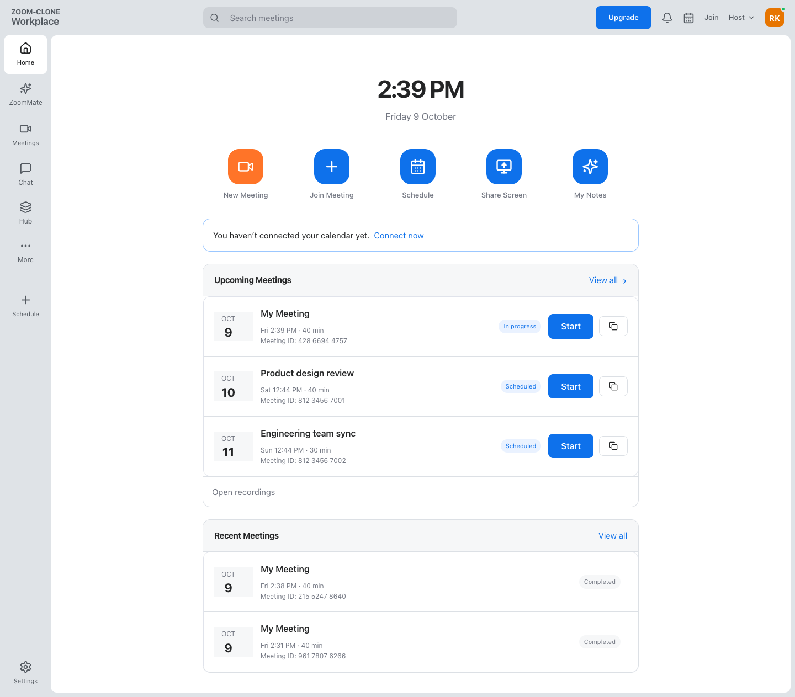
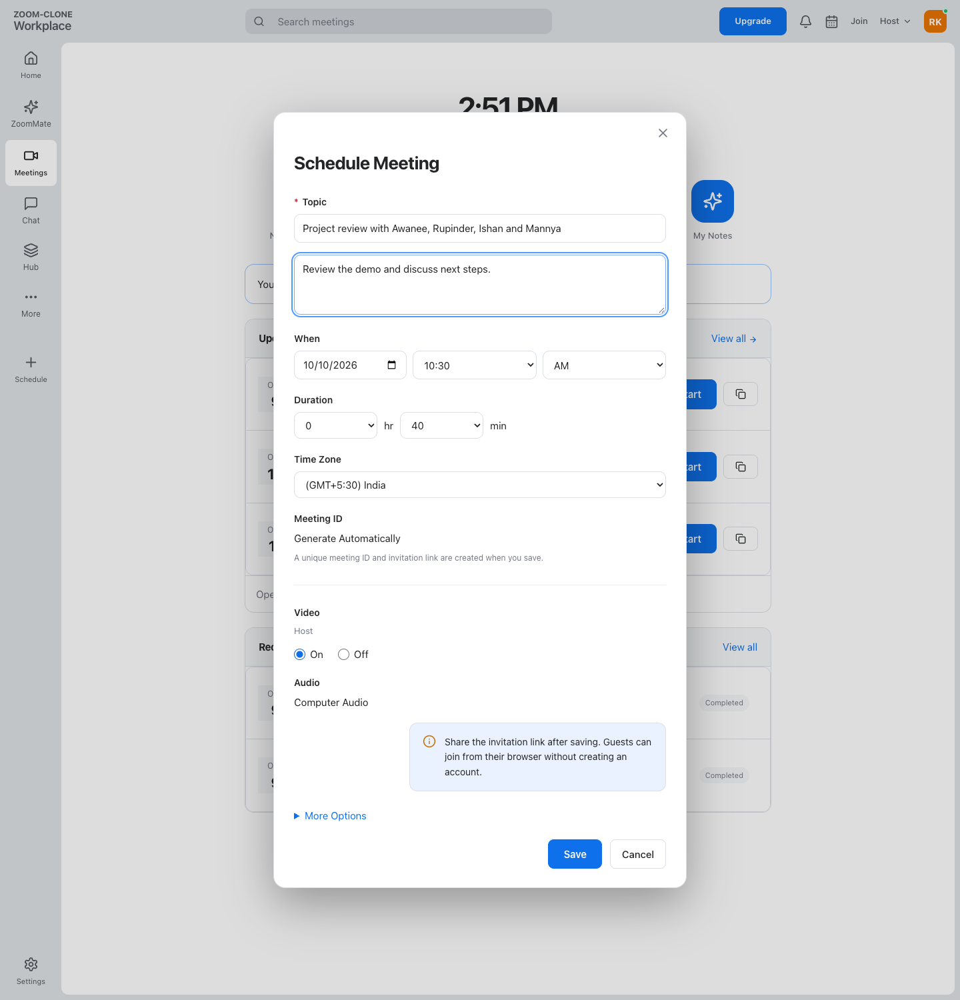
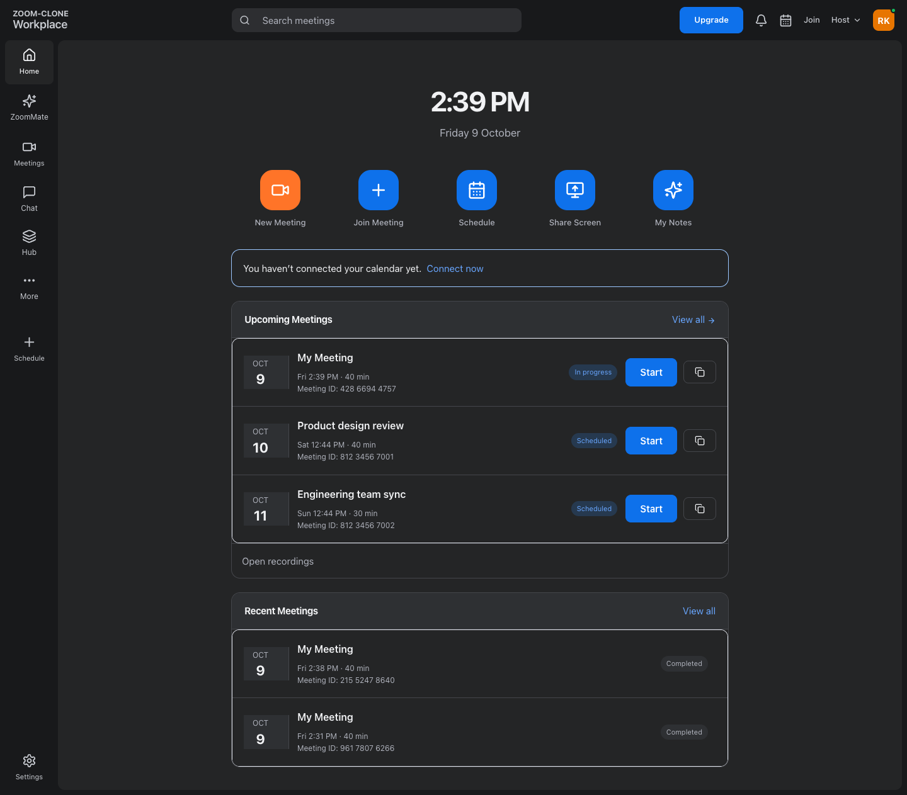
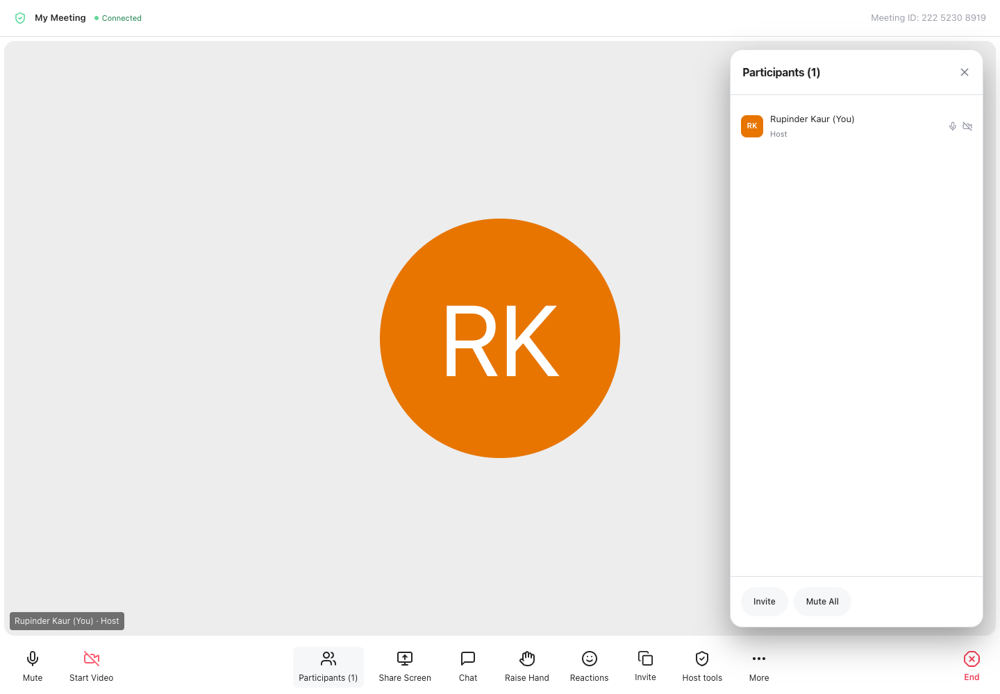
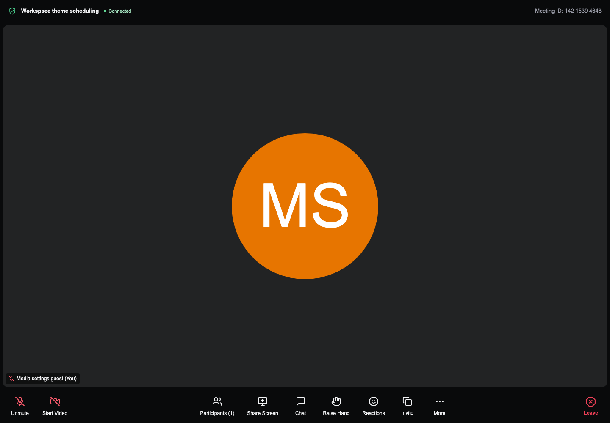
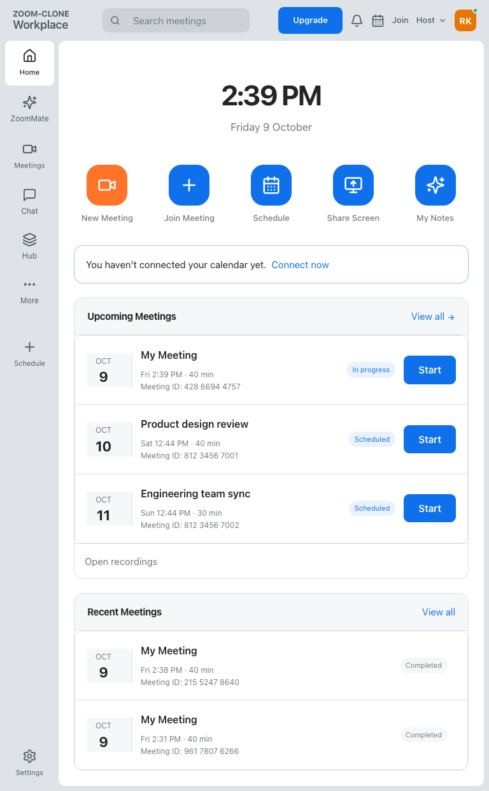
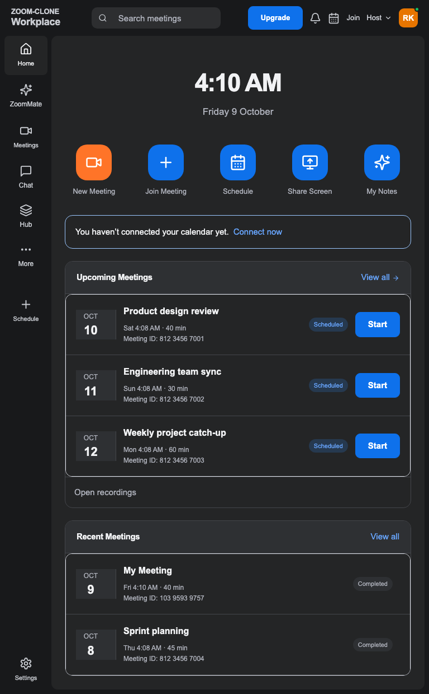
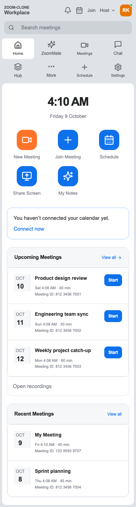
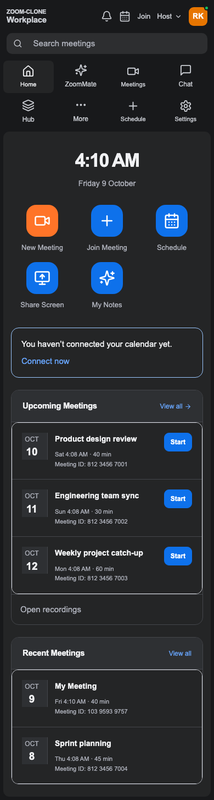

# ZOOM-CLONE

[](https://github.com/Rupinder51120/zoom-clone/actions/workflows/ci.yml)

A full-stack meeting application inspired by the supplied Zoom UI: create meetings, share invitations, join browser audio/video calls and schedule meetings. The homepage opens the dashboard directly—no login required.

- **Author:** Rupinder Kaur ([@Rupinder51120](https://github.com/Rupinder51120))
- **Live demo:** [zoom-clone-bice-mu.vercel.app](https://zoom-clone-bice-mu.vercel.app/)
- **Repository:** [Rupinder51120/zoom-clone](https://github.com/Rupinder51120/zoom-clone)
- **Stack:** Next.js 16 · TypeScript · Tailwind CSS 4 · FastAPI · SQLAlchemy · Alembic · SQLite · WebRTC · WebSockets
- **Tests:** 57 backend tests (pytest) and 20 browser tests (Playwright), with build, types, formatting and lint checks in CI.
- **Checklist:** [corefeatures.md](corefeatures.md) · **Deployment guide:** [DEPLOYMENT.md](DEPLOYMENT.md)

**Try it in two minutes:** open the [live demo](https://zoom-clone-bice-mu.vercel.app/) → **New Meeting** → preview devices and **Start Meeting** → copy the invitation and join from another browser/device → try chat, reactions and host controls → **End** the call. Select **Schedule** to create a meeting and find it under **Upcoming**. No login is required.

Allow camera/microphone access when testing media. Unrelated Zoom products open labeled preview notices.

## Screenshots

Actual application screenshots. Open an image to inspect the full view. Tablet and mobile layouts are grouped below.

| Dashboard · Light | Join meeting | Schedule meeting |
| --- | --- | --- |
|  |  |  |
| **Dashboard · Dark** | **Meeting room · Light** | **Meeting room · Dark** |
|  |  |  |

<details>
<summary><strong>Tablet versions — light and dark UI</strong></summary>

| Light UI | Dark UI |
| --- | --- |
|  |  |

</details>

<details>
<summary><strong>Mobile versions — light and dark UI</strong></summary>

| Light UI | Dark UI |
| --- | --- |
|  |  |

</details>

### For evaluators: where to find the evidence

| Criterion | Where to look |
| --- | --- |
| Functionality | [Feature checklist](corefeatures.md); [20 browser tests](frontend/tests/regression/) and [57 backend tests](backend/tests/regression/) cover core workflows, optional authentication and host controls. [Collaboration tests](frontend/tests/regression/collaboration.spec.ts) cover admission, chat, reactions, hands and synthetic screen sharing. |
| UI/UX | [Screenshots](#screenshots); [dashboard](frontend/src/components/dashboard.tsx), [meeting room](frontend/src/components/room.tsx) and [workspace styles](frontend/src/app/workspace.css). [Responsive tests](frontend/tests/regression/workflows.spec.ts) cover light/dark layouts at mobile, tablet and desktop widths; [accessibility tests](frontend/tests/regression/accessibility.spec.ts) check keyboard focus and reduced motion. |
| Database design | [Schema](#database-schema): four tables with foreign keys, unique meeting codes and hashed tokens. See [models](backend/app/models.py), [Alembic migrations](backend/migrations/versions/), [seed data](backend/app/seed.py) and [migration/API smoke checks](backend/ci/verify.py). |
| Backend / API design | [API overview](#api-overview), [FastAPI routes and room events](backend/app/main.py), [meeting service](backend/app/services/meetings.py) and [request validation](backend/app/schemas.py). [Admission regressions](backend/tests/regression/test_admission_regressions.py) and [collaboration tests](backend/tests/regression/test_collaboration.py) check authorization. |
| Code quality | Strict [TypeScript configuration](frontend/tsconfig.json), Prettier, Ruff, production build and both regression suites run in [GitHub Actions](.github/workflows/ci.yml). |
| Code modularity | [UI components](frontend/src/components/), [media hook](frontend/src/hooks/use-media.ts), [call hook](frontend/src/hooks/use-call.ts), [meeting service](backend/app/services/meetings.py), [auth](backend/app/auth.py) and [room registry](backend/app/rooms.py) separate responsibilities. |
| Code understanding | [Architecture and design decisions](#tech-stack-and-architecture), [schema](#database-schema) and [assumptions](#assumptions-and-limitations) explain the proxy, host authorization, persistence and single-process room model. |

---

## Contents

1. [Assignment coverage](#assignment-coverage)
2. [Running locally](#running-locally)
3. [Tech stack and architecture](#tech-stack-and-architecture)
4. [Database schema](#database-schema)
5. [API overview](#api-overview)
6. [Verification](#verification)
7. [Deployment](#deployment)
8. [Assumptions and limitations](#assumptions-and-limitations)
9. [Submission notes](#submission-notes)

---

## Running locally

Prerequisites: Python 3.11+, Node.js 20.9+ and Git. CI uses Python 3.11 and Node.js 22.

### Backend — port 8000

```bash
cd backend
python3 -m venv .venv
source .venv/bin/activate
python -m pip install -r requirements.lock.txt
cp .env.example .env
python -m alembic upgrade head
python -m uvicorn app.main:app --host 0.0.0.0 --port 8000 --workers 1
```

### Frontend — port 3000

In another terminal:

```bash
cd frontend
npm ci
cp .env.example .env.local
npm run dev
```

Open [localhost:3000](http://localhost:3000). API documentation: [localhost:8000/docs](http://localhost:8000/docs).

On Windows PowerShell, use `py -3.11 -m venv .venv`, `.\.venv\Scripts\Activate.ps1` and `Copy-Item` instead of `source`/`cp`. Keep any existing configured environment files.

| Variable | Where / purpose |
| --- | --- |
| `DATABASE_URL` | Backend; local `sqlite:///./zoom.db`, persistent volume in production |
| `HOST_API_KEY` | Same secret on backend and frontend server; never use a `NEXT_PUBLIC_` prefix |
| `BACKEND_URL` | Frontend server; local `http://127.0.0.1:8000` |
| `NEXT_PUBLIC_WS_URL` | Browser; local `ws://localhost:8000`, production `wss://…` |
| `FRONTEND_URL`, `ALLOWED_ORIGINS` | Backend; invitation origin and permitted browser origins |
| `APP_ORIGIN` | Frontend server; exact production frontend origin |
| `ICE_SERVERS_JSON` | Backend; configurable STUN/TURN server array |
| `DEMO_PASSWORD` | Backend; optional demo-account password, at least 12 characters |

Example environment files provide local values. Replace the development gateway key with a shared random secret in production. TURN credentials are delivered to admitted browsers; use appropriate temporary credentials.

## Assignment coverage

| Brief requirement | Implemented behavior |
| --- | --- |
| Dashboard | New Meeting, Join, Schedule, Upcoming and Recent; search; profile/settings placeholders |
| Instant meeting | Unique 11-digit ID, shareable invite link and host-room redirect |
| Join | ID or invite URL, display name, meeting validation and device preview |
| Schedule | Title, description, date/time, timezone, duration, generated invitation, SQLite persistence and Upcoming integration |
| Calls | WebRTC audio/video, camera/microphone controls, participants, invitations, leave and end-for-everyone |
| Bonus | Responsive desktop/tablet/mobile, system light/dark theme, optional signup/signin/signout, backend-authorized mute-all and removal |
| No login required | Shared default workspace; all core workflows available without an account |
| Sample data and database | Demo user, upcoming/completed meetings, SQLAlchemy relationships and Alembic migrations |
| Documentation and delivery | Setup, schema, assumptions, public GitHub repository and deployed demo |

**Seed data:** a default user, Rupinder Kaur, and five sample meetings: Product design review, Engineering team sync, Weekly project catch-up, Sprint planning and Design walkthrough. Seeding runs at startup and preserves existing records.

**Additional live features:** meeting chat, reactions, raise/lower hand, desktop screen sharing, and optional host-managed waiting room. Screen capture requires browser support; mobile participants can view desktop shares.

**Preview only:** rename, meeting lock, advanced permissions, profile preferences, calendar integrations/export, AI, recording, breakout rooms and upgrades. These controls do not perform their advertised actions.

## Tech stack and architecture

| Layer | Technology / purpose |
| --- | --- |
| Frontend | Next.js 16 App Router, React 19 and TypeScript |
| Interface | Tailwind CSS 4, shared CSS tokens, Lucide icons and native modal dialogs |
| Backend | Python 3.11+, FastAPI and Pydantic request validation |
| Persistence | SQLite, SQLAlchemy and Alembic migrations |
| Real time | WebSockets for signaling/events; native WebRTC for audio/video |
| Checks | pytest, Playwright, TypeScript, Prettier and Ruff |
| Hosting | Vercel frontend; Railway API with persistent storage |

```text
Browser → Next.js API proxy → FastAPI → SQLite
Browser ↔ FastAPI WebSocket signaling and room events
Browser ↔ Other browser: WebRTC media (direct or through TURN)
```

- `frontend/src/components/`: reusable dashboard, forms, navigation and room UI.
- `frontend/src/hooks/`: media devices and peer connections.
- `backend/app/`: API, validation, authorization, models and room registry.
- `backend/migrations/`: versioned Alembic schema changes.

**Design decisions:** the server proxy keeps the gateway key out of browser bundles. FastAPI checks participant/host credentials before accepting room commands. SQLite stores durable meeting data; connected room state stays in memory. Native modal dialogs contain keyboard focus; CSS tokens follow system appearance and respect reduced motion.

## Database schema

| Table | Purpose / relationships |
| --- | --- |
| `users` | Demo/optional accounts; one user hosts many meetings |
| `meetings` | Unique indexed code, host foreign key, schedule, duration, status and hashed host token |
| `participants` | Meeting/user foreign keys, role, hashed admission token and join/leave/removal timestamps |
| `auth_sessions` | User foreign key, hashed session token and expiry |

Guest participants can have no account. Schedule timestamps are stored in UTC with an IANA timezone for display. Existing compatibility fields/handlers remain outside the supported interface.

## API overview

FastAPI exposes interactive OpenAPI documentation at `/docs`.

| Endpoint | Purpose |
| --- | --- |
| `GET /health` | Service health |
| `GET /api/meetings` | List meetings |
| `POST /api/meetings` | Create instant/scheduled meeting |
| `GET /api/meetings/{code}` | Meeting details |
| `POST /api/meetings/{code}/join` | Validate and admit participant |

HTTP requests from the app go through `/api/backend/*`. WebSockets carry admission, signaling and authorized room events; WebRTC carries media.

## Verification

Validation on **9 October 2026**:

| Check | Result |
| --- | --- |
| Included backend regression tests | 57 passed |
| Current-scope browser acceptance | 20 passed, including pending-permission recovery, synthetic peer media and host controls |
| Frontend production build / TypeScript / Prettier | Passed |
| Backend Ruff lint / formatting | Passed |
| Disposable SQLite migrations, seed, health and authorization smoke check | Passed |
| Physical-device checks | Owner confirmed the earlier feature set on Mac/Android, on the same Wi-Fi and different networks; new collaboration additions await physical retesting |
| Responsive and appearance checks | Light/dark at 390, 768 and 1440 px; keyboard focus and reduced motion |

Browser coverage includes create/join/schedule persistence, invitations, optional auth, host mute/removal/end, waiting-room admission, bidirectional chat, reactions, raised hands, synthetic screen-track delivery/stop and preview controls.

```bash
# From frontend/
npm run format:check
npm run build
npm run typecheck

# From backend/
python ci/verify.py
```

The curated suites are included in `backend/tests/regression/` and `frontend/tests/regression/`. Historical test experiments, screenshots, recordings and reports stay ignored. Automated calls use synthetic media; physical-device validation is recorded separately above.

To reproduce the included tests, activate the backend virtual environment first (it must provide `python` in the frontend terminal):

```bash
# From backend/ with .venv activated
python -m pytest -q

# From frontend/ in the same activated environment
npx playwright install chromium
npm run test:e2e
```

The browser command builds the app, starts temporary services on **8004/3004**, runs 20 cases and stops the services. Keep those ports free and stop your local production frontend before rebuilding. Its SQLite database is disposable; existing development data is preserved. CI runs both included suites plus migration/API smoke checks.

## Deployment

Frontend runs on [Vercel](https://zoom-clone-bice-mu.vercel.app/); API runs on [Railway](https://zoom-clone-production-8be6.up.railway.app/health). Use a persistent `/data` volume for SQLite and **one API replica/worker** for in-memory rooms. HTTPS/WSS is required for deployed browser media.

GitHub Actions runs frontend checks and backend smoke verification. Optional Actions deployment needs configured credentials; the existing Vercel Git integration deploys frontend pushes. See [DEPLOYMENT.md](DEPLOYMENT.md) for service roots, variables and deployment configuration.

## Assumptions and limitations

- No login is required: visitors use the shared default workspace. Authentication is an optional demo bonus, without OAuth, email verification, recovery or MFA.
- STUN/TURN is configurable; TURN-only connectivity and participant capacity have not been independently verified.
- One API process is intentional. Restarting loses active room state; persisted meeting metadata remains.
- Zoom-style typography uses native system fonts. Exact proprietary font assets and animation timing are not claimed.
- Out-of-scope products remain explicit placeholders. No recording, AI or billing support is claimed. Screen capture requires a supported browser; unsupported browsers can still receive shared screens.

## Submission notes

No login is required: the app opens a shared default demo workspace, with optional signup/signin. SQLite is seeded with a demo user and sample upcoming/completed meetings; meetings created by visitors are stored in the database. Core meeting workflows and bonus host controls are functional. Chat, reactions, raised hands, desktop screen sharing and optional waiting-room admission are also implemented. Unrelated Zoom products are labeled previews. Screen capture depends on browser support; mobile users can view desktop shares. The backend uses one process and persistent SQLite storage; restarting clears active room state but preserves meeting records.

## Submission deliverables

| Deliverable | Location |
| --- | --- |
| Public source code | [Rupinder51120/zoom-clone](https://github.com/Rupinder51120/zoom-clone) |
| Hosted application | [ZOOM-CLONE on Vercel](https://zoom-clone-bice-mu.vercel.app/) |
| Backend health | [Railway health endpoint](https://zoom-clone-production-8be6.up.railway.app/health) |
| Feature checklist | [corefeatures.md](corefeatures.md) |
| Deployment configuration | [DEPLOYMENT.md](DEPLOYMENT.md), `.github/workflows/`, `backend/railway.json` |

## Attribution and repository contents

An independent full-stack assignment implementation inspired by the supplied Zoom references. Zoom's name and design belong to their respective owners; this project is not affiliated with Zoom. Screenshots show this application.

Source, locked dependencies, migrations, example configuration, regression tests, CI smoke checks and curated screenshots are included. Secrets, databases, installed dependencies, historical test experiments, recordings, reports and planning notes are gitignored.

## Author

Built by **Rupinder Kaur** ([@Rupinder51120](https://github.com/Rupinder51120)) for the SDE Fullstack assignment.
