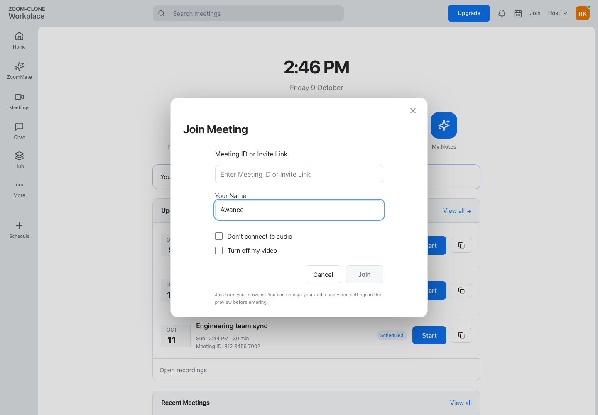

# ZOOM-CLONE: a Zoom Workplace clone

A full-stack meeting application inspired by the supplied Zoom UI: create meetings, share invitations, join browser audio/video calls and schedule meetings. The homepage opens the dashboard directly—no login required.

- **Live demo:** [zoom-clone-bice-mu.vercel.app](https://zoom-clone-bice-mu.vercel.app/)
- **Repository:** [Rupinder51120/zoom-clone](https://github.com/Rupinder51120/zoom-clone)
- **Stack:** Next.js 16 · TypeScript · Tailwind CSS 4 · FastAPI · SQLAlchemy · Alembic · SQLite · WebRTC · WebSockets
- **Verification:** 62 backend tests and 16 current-scope browser tests passed locally on 9 October 2026. Browser calls use synthetic media devices.
- **Checklist:** [corefeatures.md](corefeatures.md) · **Deployment guide:** [DEPLOYMENT.md](DEPLOYMENT.md)

## Contents

[Demo](#demo) · [Features](#features) · [Setup](#running-locally) · [Architecture](#architecture) · [Database](#database-schema) · [API](#api-overview) · [Testing](#testing) · [Deployment](#deployment) · [Assumptions](#assumptions-and-limitations)

## Demo

Actual browser captures of the application. Mobile/tablet images show responsive viewports; they are not physical-device test evidence.

| Desktop light | Desktop dark |
| --- | --- |
|  |  |

| Join meeting | Schedule meeting |
| --- | --- |
|  |  |

| Tablet | Mobile |
| --- | --- |
|  |  |

<details>
<summary>Meeting room and additional responsive appearances</summary>


Camera-off local demonstration. Chat, screen sharing and other extra toolbar entries are labeled previews.

| Tablet dark | Mobile light |
| --- | --- |
|  |  |

</details>

## Features

| Area | Implemented behavior |
| --- | --- |
| Dashboard | New Meeting, Join, Schedule, Upcoming and Recent; search; profile/settings placeholders |
| Instant meeting | Unique 11-digit ID, shareable invite link and host-room redirect |
| Join | ID or invite URL, display name, meeting validation and device preview |
| Schedule | Title, description, date/time, timezone, duration, generated invitation, SQLite persistence and Upcoming integration |
| Calls | WebRTC audio/video, camera/microphone controls, participants, invitations, leave and end-for-everyone |
| Bonus | Responsive desktop/tablet/mobile, system light/dark theme, optional signup/signin/signout, backend-authorized mute-all and removal |

**Seed data:** a default user, Rupinder Kaur, and five sample meetings: Product design review, Engineering team sync, Weekly project catch-up, Sprint planning and Design walkthrough. Seeding runs at startup and preserves existing records.

**Preview only:** chat, reactions, raise hand, screen sharing, rename, waiting room, meeting lock, advanced permissions, profile preferences, calendar integrations/export, AI, recording, breakout rooms and upgrades. These controls do not perform their advertised actions.

## Running locally

Prerequisites: Python 3.11+, Node.js 20.9+ and Git. CI uses Python 3.11 and Node.js 22.

### Backend — port 8000

```bash
cd backend
python3 -m venv .venv
source .venv/bin/activate
python -m pip install -r requirements.lock.txt
cp .env.example .env
python -m alembic upgrade head
python -m uvicorn app.main:app --host 0.0.0.0 --port 8000 --workers 1
```

### Frontend — port 3000

In another terminal:

```bash
cd frontend
npm ci
cp .env.example .env.local
npm run dev
```

Open [localhost:3000](http://localhost:3000). API documentation: [localhost:8000/docs](http://localhost:8000/docs).

On Windows PowerShell, use `py -3.11 -m venv .venv`, `.\.venv\Scripts\Activate.ps1` and `Copy-Item` instead of `source`/`cp`. Keep any existing configured environment files.

| Variable | Where / purpose |
| --- | --- |
| `DATABASE_URL` | Backend; local `sqlite:///./zoom.db`, persistent volume in production |
| `HOST_API_KEY` | Same secret on backend and frontend server; never use a `NEXT_PUBLIC_` prefix |
| `BACKEND_URL` | Frontend server; local `http://127.0.0.1:8000` |
| `NEXT_PUBLIC_WS_URL` | Browser; local `ws://localhost:8000`, production `wss://…` |
| `FRONTEND_URL`, `ALLOWED_ORIGINS` | Backend; invitation origin and permitted browser origins |
| `APP_ORIGIN` | Frontend server; exact production frontend origin |
| `ICE_SERVERS_JSON` | Backend; configurable STUN/TURN server array |
| `DEMO_PASSWORD` | Backend; optional demo-account password, at least 12 characters |

Example environment files provide local values. Replace the development gateway key with a shared random secret in production. TURN credentials are delivered to admitted browsers; use appropriate temporary credentials.

## Architecture

```text
Browser → Next.js API proxy → FastAPI → SQLite
Browser ↔ FastAPI WebSocket signaling and room events
Browser ↔ Other browser: WebRTC media (direct or through TURN)
```

- `frontend/src/components/`: reusable dashboard, forms, navigation and room UI.
- `frontend/src/hooks/`: media devices and peer connections.
- `backend/app/`: API, validation, authorization, models and room registry.
- `backend/migrations/`: versioned Alembic schema changes.

**Design decisions:** the server proxy keeps the gateway key out of browser bundles. FastAPI checks participant/host credentials before accepting room commands. SQLite stores durable meeting data; connected room state stays in memory. Native modal dialogs contain keyboard focus; CSS tokens follow system appearance and respect reduced motion.

## Database schema

| Table | Purpose / relationships |
| --- | --- |
| `users` | Demo/optional accounts; one user hosts many meetings |
| `meetings` | Unique indexed code, host foreign key, schedule, duration, status and hashed host token |
| `participants` | Meeting/user foreign keys, role, hashed admission token and join/leave/removal timestamps |
| `auth_sessions` | User foreign key, hashed session token and expiry |

Guest participants can have no account. Schedule timestamps are stored in UTC with an IANA timezone for display. Existing compatibility fields/handlers remain outside the supported interface.

## API overview

FastAPI exposes interactive OpenAPI documentation at `/docs`.

| Endpoint | Purpose |
| --- | --- |
| `GET /health` | Service health |
| `GET /api/meetings` | List meetings |
| `POST /api/meetings` | Create instant/scheduled meeting |
| `GET /api/meetings/{code}` | Meeting details |
| `POST /api/meetings/{code}/join` | Validate and admit participant |

HTTP requests from the app go through `/api/backend/*`. WebSockets carry admission, signaling and authorized room events; WebRTC carries media.

## Testing

Latest local run: **62 backend + 16 browser cases passed**, covering core workflows, persistence, optional auth, synthetic peer media, host controls, previews, responsive themes, keyboard focus and reduced motion. Build, TypeScript, Prettier, Ruff and disposable migration/seed/API verification also passed.

```bash
# From frontend/
npm run format:check
npm run build
npm run typecheck

# From backend/
python ci/verify.py
```

Full local test sources and generated reports are gitignored as requested. A fresh clone can run the included CI smoke script and frontend checks; it does not contain the 62/16 local suites. Private evaluator scripts are unavailable. The owner reported Mac/Android calls working on the same Wi-Fi and different networks; this is separate from automated media testing.

## Deployment

Frontend runs on [Vercel](https://zoom-clone-bice-mu.vercel.app/); API runs on [Railway](https://zoom-clone-production-8be6.up.railway.app/health). Use a persistent `/data` volume for SQLite and **one API replica/worker** for in-memory rooms. HTTPS/WSS is required for deployed browser media.

GitHub Actions runs frontend checks and backend smoke verification. Optional Actions deployment needs configured credentials; the existing Vercel Git integration deploys frontend pushes. See [DEPLOYMENT.md](DEPLOYMENT.md) for service roots, variables and deployment configuration.

## Assumptions and limitations

- No login is required: visitors use the shared default workspace. Authentication is an optional demo bonus, without OAuth, email verification, recovery or MFA.
- STUN/TURN is configurable; TURN-only connectivity and participant capacity have not been independently verified.
- One API process is intentional. Restarting loses active room state; persisted meeting metadata remains.
- Zoom-style typography uses native system fonts. Exact proprietary font assets and animation timing are not claimed.
- Out-of-scope products remain explicit placeholders. No recording, AI, screen-sharing or billing support is claimed.
